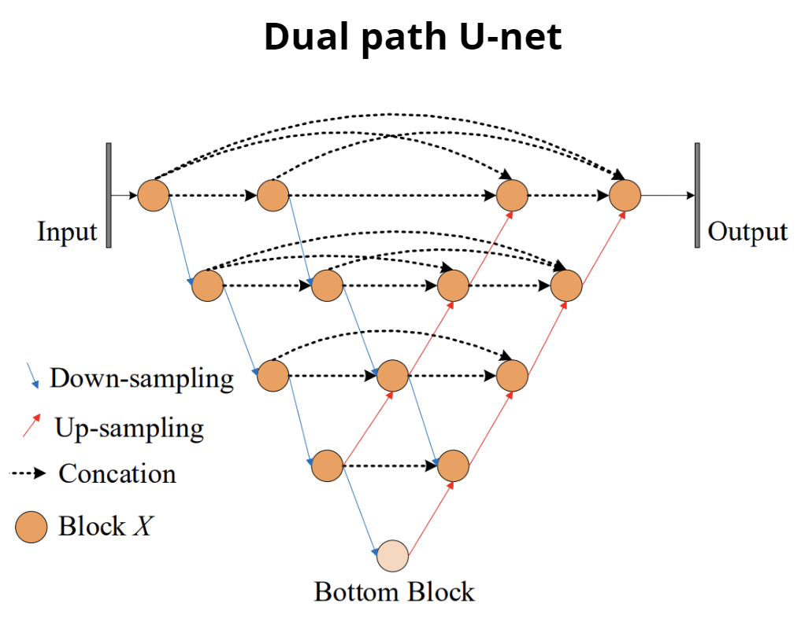

# InteractiveCellSegmentation

The main objective of this project was to explore the use of convolutional neural networks for interactive image 
segmentation. This type of image segmentation is characterized by the inclusion in the segmentation process of the 
user's will conveyed through interaction in a specific form, in the case under consideration by means of clicks. The 
data used in the project is a publicly available dataset by the Human Protein Atlas (https://www.proteinatlas.org/) 
project, consisting of images of human protein cells taken using confocal microscopy.

In addition, a new convolutional encoder-decoder architecture was proposed and compared with state-of-the-art 
architectures, with results indicating that the proposed architecture is more accurate. The proposed architecture is a 
dual-path u-net with spatial and channel attentional modules in the up-sampling path:  

The proposed solution was tested using a simple GUI to perform real-time interactive image segmentation using neural 
networks trained in this project. Below is a brief presentation of the GUI and its functionality:

